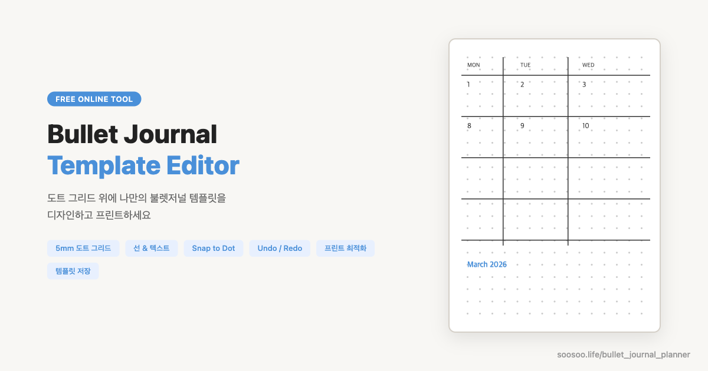

# Bullet Journal Template Editor

무료 온라인 불렛저널 템플릿 에디터. 도트 그리드 위에 선과 텍스트를 그려 나만의 플래너를 디자인하고 프린트하세요.

**[Live Demo → soosoo.life/bullet_journal_planner](https://soosoo.life/bullet_journal_planner)**

## Features

- **도트 그리드** — 25×37 기본, 가로/세로 커스텀 가능 (5mm 간격)
- **선 그리기** — 클릭→프리뷰→클릭, 점 스냅, 연속 그리기, ESC 취소
- **텍스트** — 4가지 폰트, 크기 조절, 90°/270° 회전
- **선택/삭제** — 요소 클릭 후 Delete/Backspace
- **Undo/Redo** — `Ctrl+Z` / `Ctrl+Shift+Z`
- **Save/Load** — JSON 파일로 저장/불러오기 (`Ctrl+S` / `Ctrl+O`)
- **프린트** — A4 가로, 여백 없음, 5mm 정확한 출력
- **좌/우 2페이지** 스프레드 뷰
- **로이텀 스타일** 가이드 마커 (1/3, 1/2, 2/3 위치)
- **선 길이 표시** — 선 중간에 칸 수 숫자 표시
- **반응형** — 데스크탑, 태블릿, 모바일 지원

## Templates

`templates/` 폴더에 기본 템플릿이 포함되어 있습니다. Load 버튼으로 불러오세요.

| 템플릿 | 파일 | 설명 |
|--------|------|------|
| 3월 캘린더 | `march-2026-calendar.json` | 먼슬리 캘린더 (SUN-SAT 7일) |
| 단식 트래커 | `fasting-tracker.json` | 습관 트래커 + 단식 차트 + MOOD/STRESS |
| 연간 캘린더 | `2026-yearly-calendar.json` | 12개월 한눈에 보기 |

## Keyboard Shortcuts

| 단축키 | 동작 |
|--------|------|
| `L` | 선 도구 |
| `T` | 텍스트 도구 |
| `V` | 선택 도구 |
| `Escape` | 선 그리기 취소 |
| `Delete` / `Backspace` | 선택 요소 삭제 |
| `Ctrl+Z` | Undo |
| `Ctrl+Shift+Z` | Redo |
| `Ctrl+S` | 저장 |
| `Ctrl+O` | 불러오기 |

## Print Guide

1. `Print` 버튼 또는 `Ctrl+P`
2. 용지 방향: **가로**
3. 배율: **100%** (페이지에 맞추기 해제)
4. 여백: **없음**

→ 좌/우 페이지가 한 장에 5mm 정확한 도트 간격으로 출력됩니다.

## Tech Stack

- Vanilla HTML/CSS/JS (단일 파일, 빌드 없음)
- SVG (mm 단위 정밀 렌더링)
- Glassmorphism UI (backdrop-filter)
- 반응형 디자인 (CSS media queries)